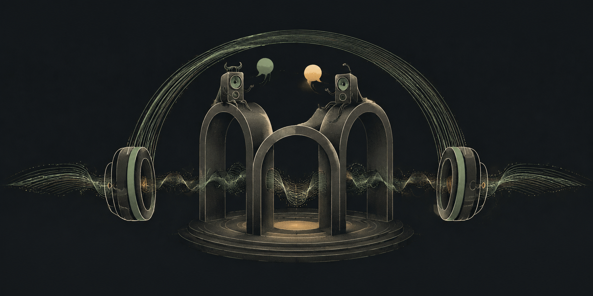
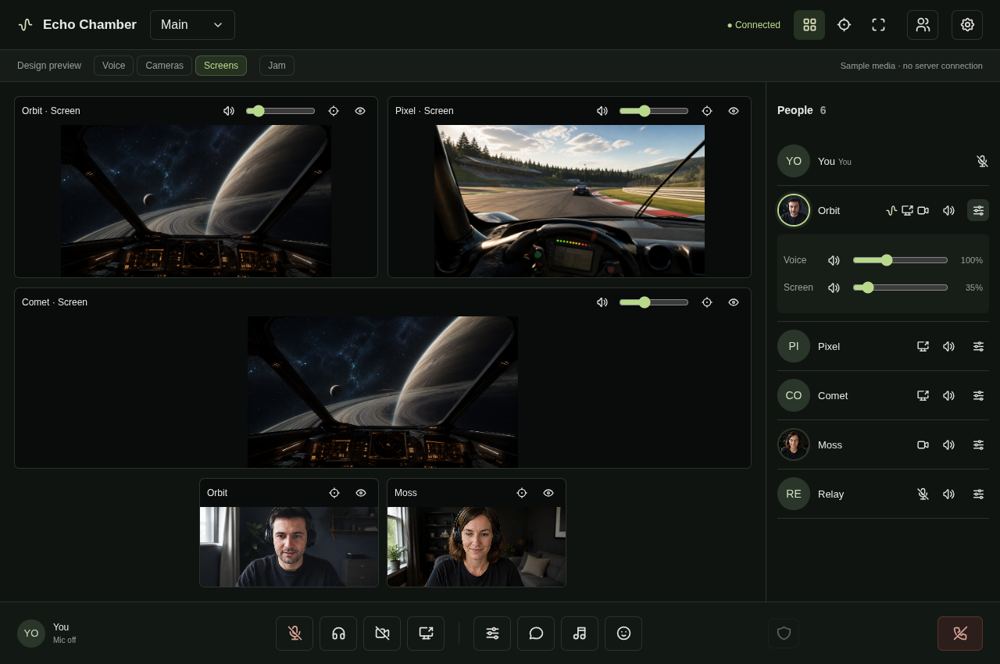
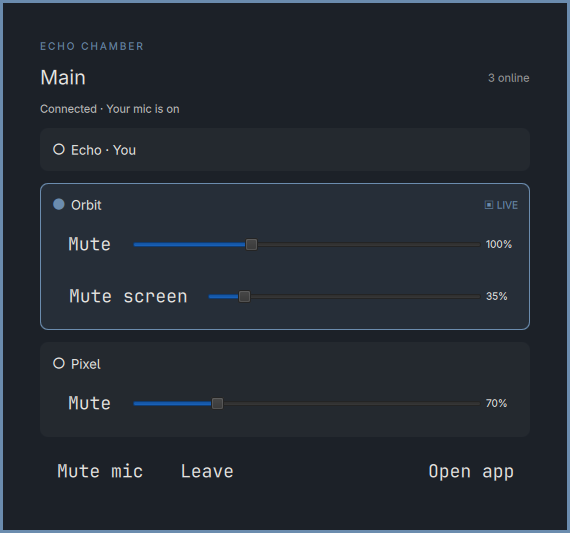
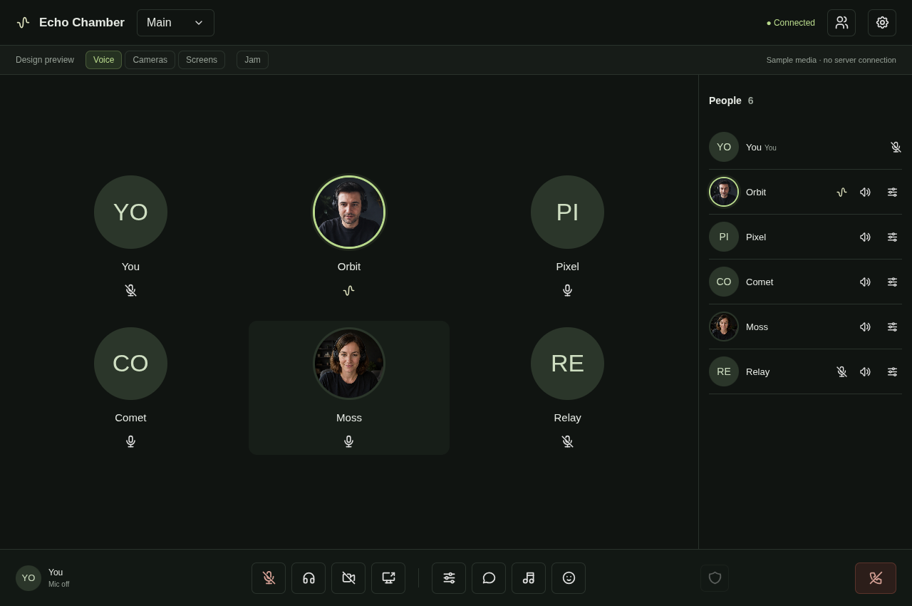

<p align="center">
  
</p>

# Echo Chamber for Omarchy

Voice, screen sharing and chat for [Echo Chamber](https://github.com/SamWatson86/echo-chamber), with a desktop app and a native Omarchy toolbar.

[Usage & troubleshooting](docs/USAGE.md) · [Feature status](docs/FEATURE-PARITY.md) · [Development](docs/DEVELOPMENT.md)

## Install

```sh
omarchy plugin add https://github.com/smstromb/echo-chamber-omarchy.git --enable
```

Requires **Omarchy’s Quickshell bar on Linux x86-64** and access to an existing Echo Chamber server. The plugin sets up the desktop app automatically; no Node.js or npm installation needed. Once setup finishes, right-click the toolbar icon to open the app and sign in.

## In the app

Shared screens, cameras and a compact participant list, with separate voice and stream volume controls. Grid, focus and fullscreen adapt to the active media.



The toolbar shows online participants before joining, then speaking activity, mute and volume controls during a call.

<p align="center">
  
</p>

<details>
<summary>Voice-only view</summary>



</details>

_Product captures use demo mode with sample handles and generated media. No live calls or personal information are shown._

## Update

```sh
omarchy plugin update local.echo-chamber
```

Quit and reopen the app when ready to use the new build. Updates preserve active calls and saved settings.

## Current limits

Outgoing screen-share audio, Linux Jam source hosting and full Windows-client parity are still in progress. Screen capture uses the desktop portal; **Remember password** requires an unlocked desktop keyring. Legacy Waybar is unsupported. See [feature status](docs/FEATURE-PARITY.md) for details, and [usage](docs/USAGE.md) for removal instructions.

[MIT license](LICENSE) · [Third-party notices](THIRD-PARTY.md)
